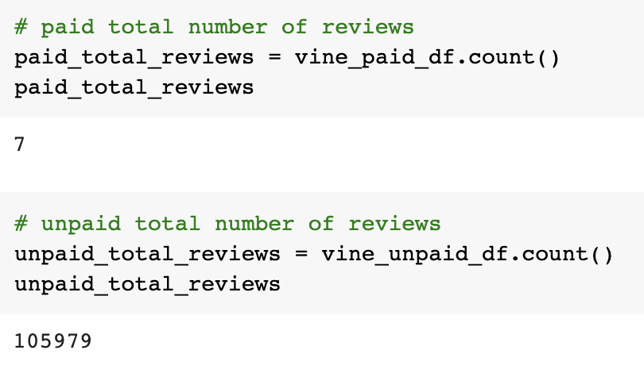
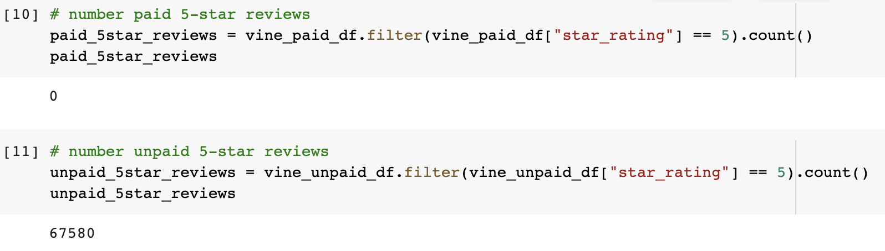

# Amazon_Vine_Analysis

## Overview 
This analysis consisted of using PySpark along with Google Collab and Amazon Web Services(AWS) to perform an ETL on a music dataset where we extract, transform and connect the data to an AWS RDS instance to load the transformed data into a PGAdmin database where we can then use PySpark to perform calculations on Amazon Vine music reviews.

## Results

- How many Vine reviews and non-Vine reviews were there?

- How many Vine reviews were 5 stars? How many non-Vine reviews were 5 stars?

- What percentage of Vine reviews were 5 stars? What percentage of non-Vine reviews were 5 stars?

## Summary: In your summary, state if there is any positivity bias for reviews in the Vine program. Use the results of your analysis to support your statement. Then, provide one additional analysis that you could do with the dataset to support your statement.
